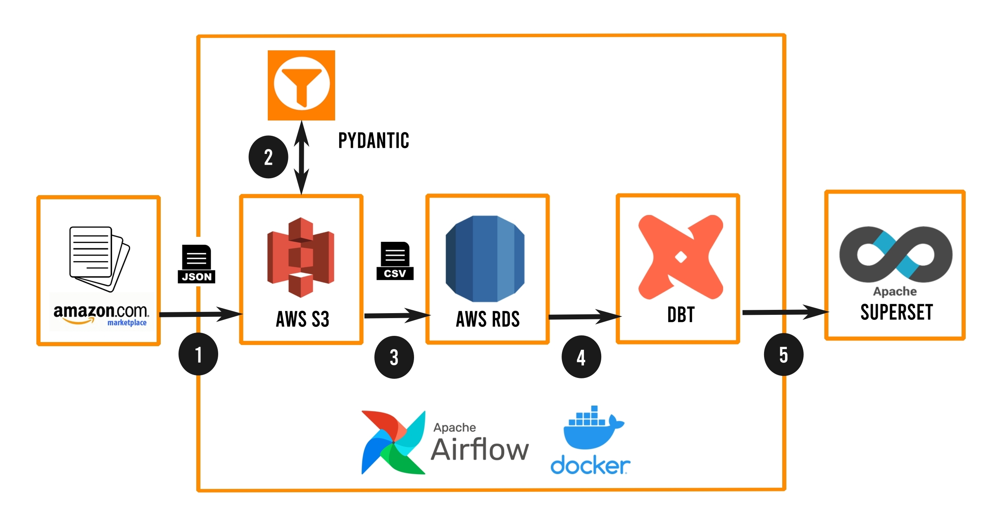

# ELT Pipeline for Customer Intelligence

Automated pipeline that scrapes product reviews and metadata for competing Amazon products daily, then validates, transforms, and summarizes data in a dashboard.

## Dashboard

## Pipeline Architecture

Pipeline flow:
1. Scrape "raw" data from [specified Amazon products](tasks/products.txt) and upload to S3
2. Sanitize and validate "raw" data using Pydantic to create "prep" data (stored in S3)
3. Load "prep" data into data warehouse (RDS)
4. Transform data within warehouse using dbt to create data marts / views
5. Display views in Apache Superset dashboard

Infrastructure also includes:
- Orchestration via Airflow
- Containerization via Docker

## Requirements

1. AWS S3, RDS -- Must add credentials to .env manually.
2. Docker -- Required to run pipeline.
3. Apache Supeset -- Must setup and add data sources manually.

## Setup

1. `make build`: Creates extended Airflow Docker image.
2. `make up`: Setup Airflow Docker container network.

## TODOS

1. Refactor dbt SQL
2. Tweak dashboard views
3. Terraform for infra provisioning